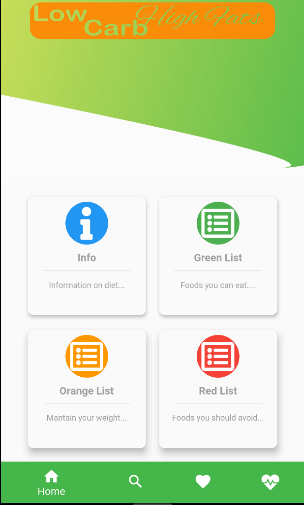
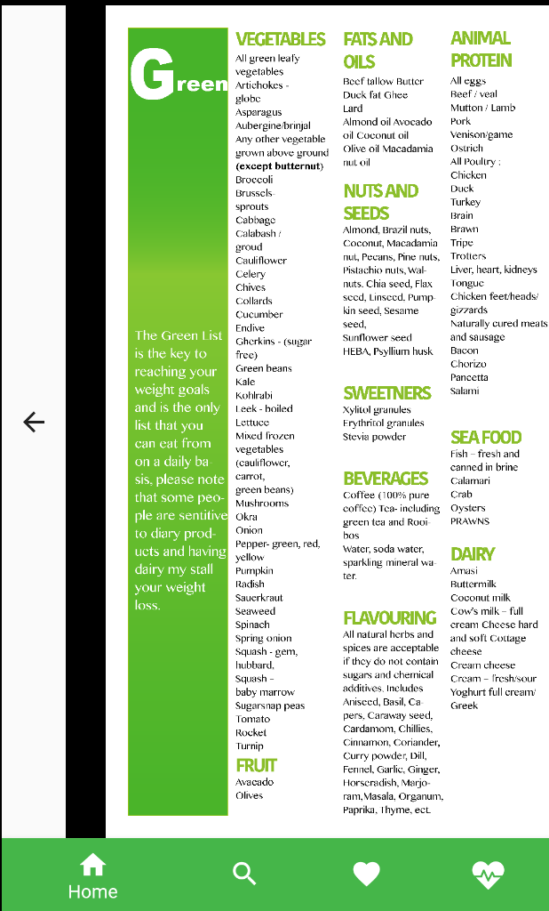
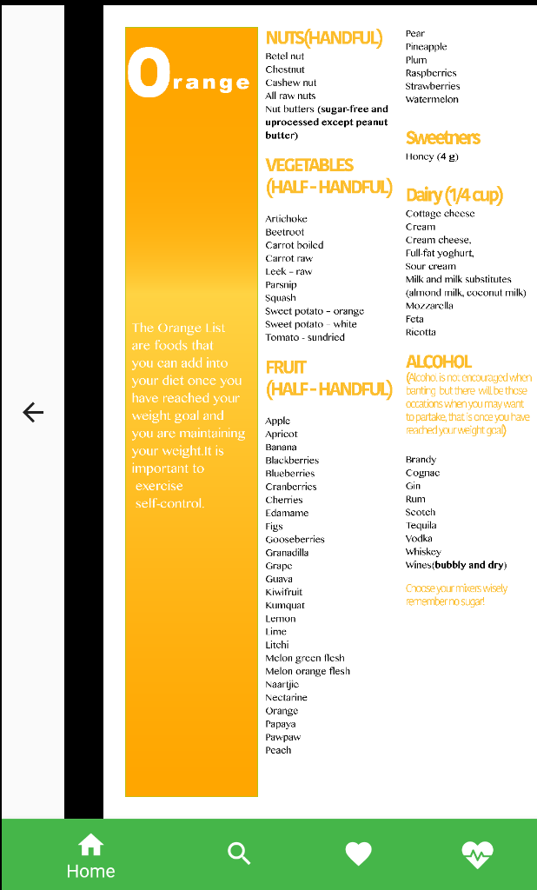
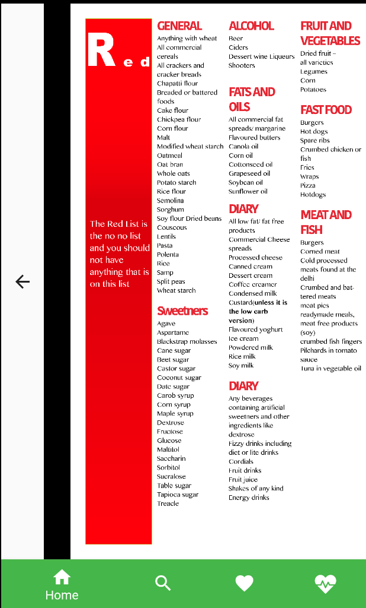
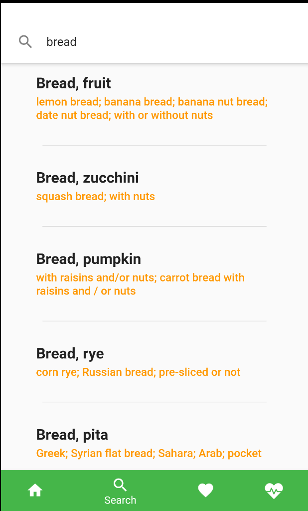
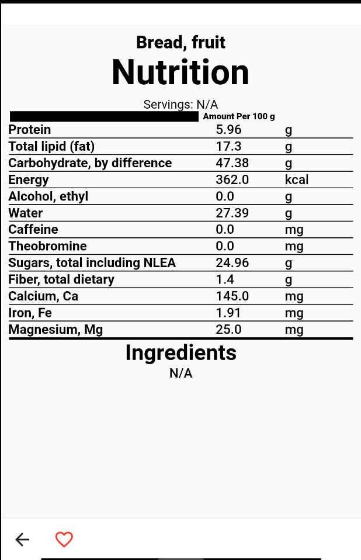
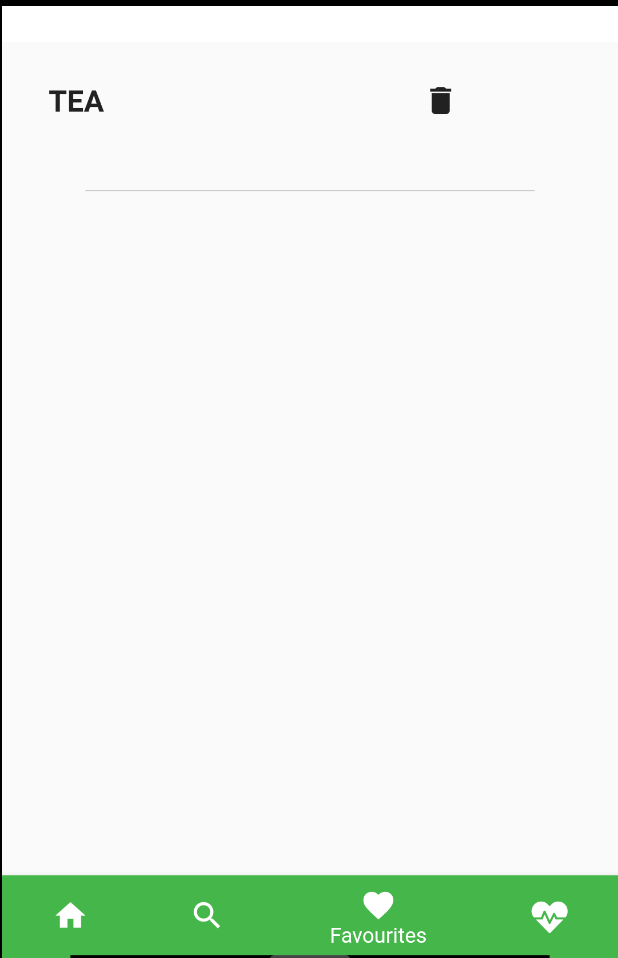
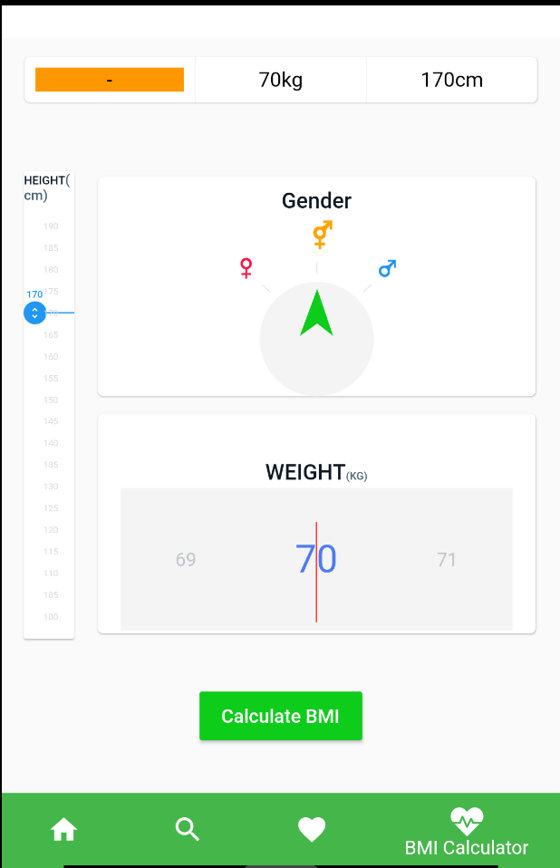

# Banting App

This mobile application is a guide for users following the Banting diet. It helps users make informed decisions about their food choices and track their health.

## Features

*   **Food Lists:** The app provides three lists of foods:
    *   **Green List:** Foods you can eat as much as you want.
    *   **Orange List:** Foods to eat in moderation.
    *   **Red List:** Foods to avoid.
*   **Nutritional Value Search:** Users can search for a food item to get its nutritional information.
*   **BMI Calculator:** The app includes a BMI calculator that takes into account gender, height, and weight to determine if the user is in a healthy weight range.

## Screenshots

